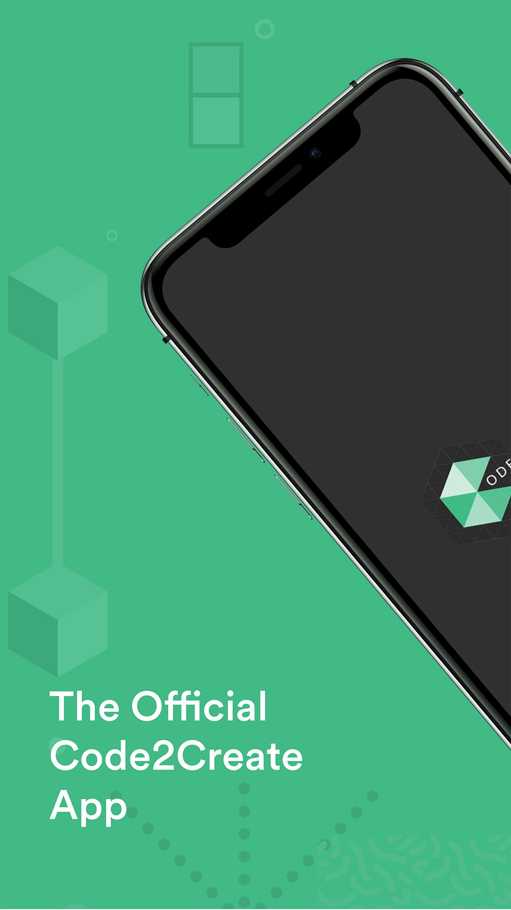
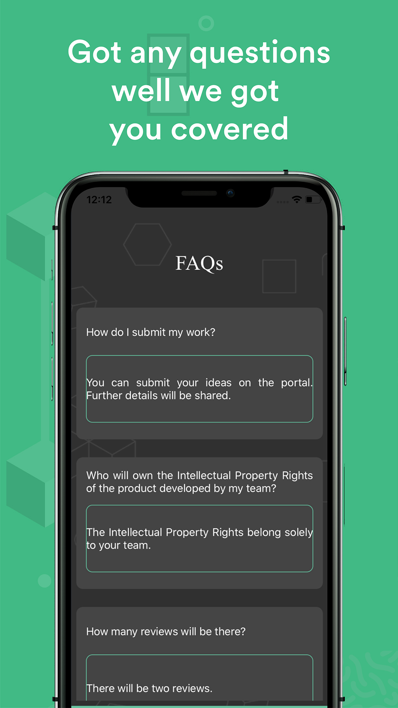
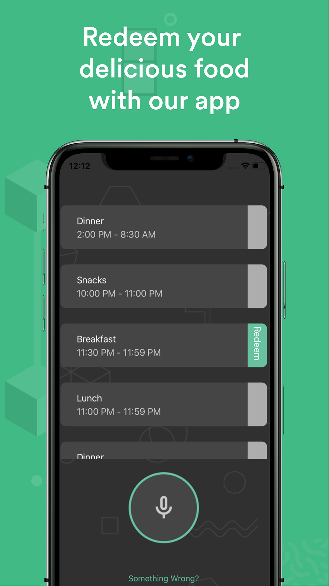

# Code2Create 4.0

Official iOS App for Code2Create 4.0

## Introduction ##
Code2Create is one of South India's biggest hackathons conducted annually by ACM(Association of Computing Machinery), VIT Vellore. Code2Create is a 36 hour hackathon held at Vellore Institute of Technology, Vellore.   
This is a one-stop app for all the needs for the participants during the app. This app covers all parts of the event - attendance, timeline, FAQs, distribution of food coupons, about the sponsors, organizers and the event. ✨

 ## Steps to run 📲 ##
 * Clone or download the app from this repository. 👩‍💻
 * Open project file in terminal. 💻
 * Run `pod intall` to install all dependencies. 📥
 * Open the `c2c.workspace` file. 💾
 * Change the bundle identifier. ⚙️
 * Press `Ctrl + R` to run the app. 📲
 * Do star this repo and/or contribute if you like it.🙂
 
 ## How to use  ##
  You can sign up to the app using Google SignIn or Sign up with your email. If you sign up with email, you will have to confirm your email address using the link that will be sent to you via email. Once signed in, you will see the timeline of the event. Keep checking the timeline in case of live updates. To the bottom of the screen there will be button, when clicked will show you all other options,i.e. FAQs, About, Food Coupons, Prizes, Sponsors and Log Out.  
 For Food Coupons you will have to click on the microphone button to redeem your coupon. You can redeem only one coupon for one meal. Once redeemed you will be able to see the redeemed status there itself. Enjoy your food now. 🙂
 
 ## Libraries used in the project 📥 ##
 * UIKit
 * Firebase
 * Google SignIn
 * Chirp
 * SwiftyJSON
 * Kingfisher
 
 ## App Screenshots 📸 ##
 

 
 
 
 
 
 

 
 ## Author 👩‍💻 ##
 [Garima Bothra](https://github.com/garima94921)
